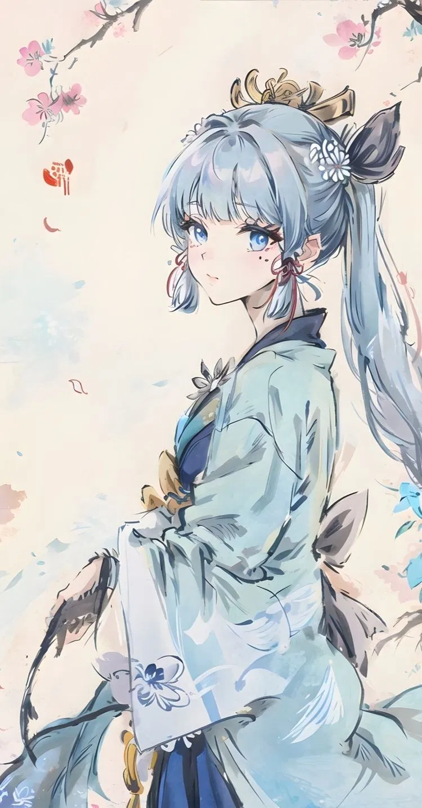

  
  
      
  <pre>
    🥀Fuyuki
    🥀18
    🥀Apprentice
    🥀France, Fontainebleau
    🥀Manga/Anime, Videogames, Dev
  </pre>
       

## Skills
### Languages & Libraries

    
      

### Tools

  <picture>
    <source align="top" media="(prefers-color-scheme: dark)" srcset="https://readme-typing-svg.herokuapp.com?font=Fira+Code&pause=1000&color=D18FF7&multiline=true&random=false&width=435&center=true&lines=Hello%2C+I'm+Fuyuki+;Dev%2C+Anime+and+Genshin+enthusiast">
  </picture>
